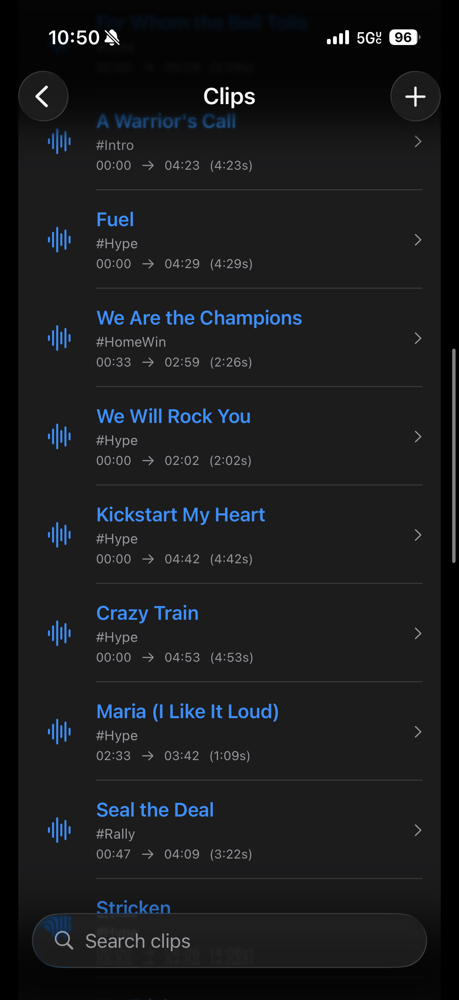
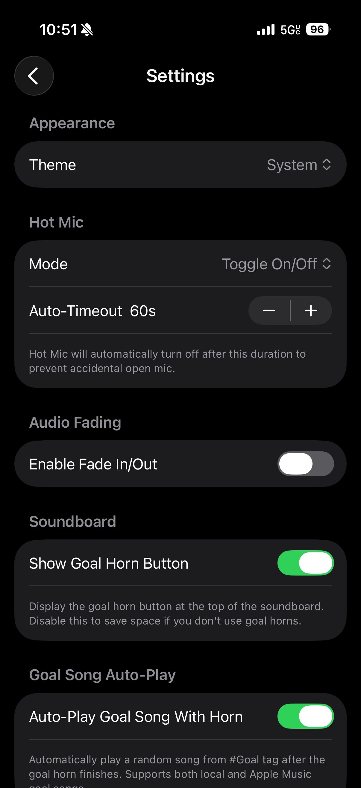
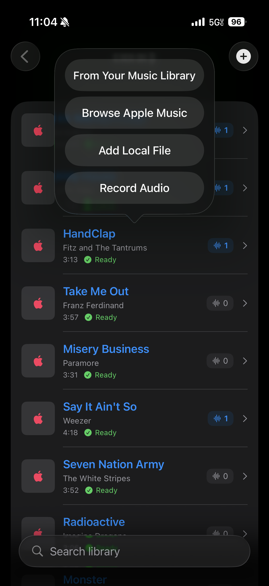
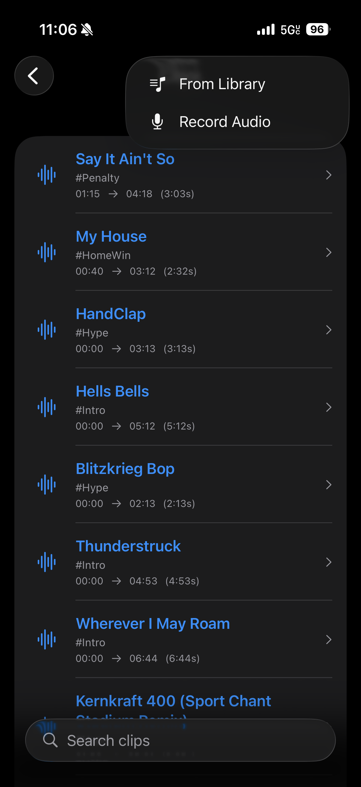

# RinkJam

### Bring the Hype to Game Day

RinkJam turns your iPhone into a powerful, customizable soundboard for sports events. Trigger music clips, goal horns, hype effects, intros, and more from one simple interface built for live game action.

Whether you're a coach, parent, or arena DJ, RinkJam helps you create an electric atmosphere your players and fans will love.

---

## What Is RinkJam?

RinkJam is a free native iOS app that lets anyone run a professional-style game-day soundboard right from their phone. It’s designed primarily for hockey, but works great for any sport or event that needs crowd energy and quick-trigger audio.

Under the hood, RinkJam is a SwiftUI app that uses AVFoundation and MusicKit to:

- Play local audio clips stored on device
- Integrate with Apple Music (when configured)
- Let you record, trim, and tag your own clips for live playback

This repository is the public landing page and issue tracker for the RinkJam app. The app’s source code lives in a separate private repository.

---

## Key Features

- **Custom Tags for Every Moment**  
  Organize your sounds by tags such as `#Goal`, `#Intro`, `#Warmup`, or `#Penalty` for quick playback during live events. Tags are auto-discovered from your clips and can be customized (colors, visibility, order).

- **Flexible Audio Clips**  
  Create clips from local audio or Apple Music content. Set **start** and **end** points so only the best part of each track is played.

- **Quick Soundboard Interface**  
  The main soundboard view shows tag groups and buttons optimized for fast, on-the-fly triggering during games.

- **Hot Mic Mode**  
  Use your device like a rink-side microphone for announcements. Choose between push-to-talk and toggle modes.

- **Now Playing Panel**  
  Always see what’s currently playing and stop it instantly when needed.

- **Audio Recording**  
  Record new audio clips directly in the app and add them to your libraries.

- **Offline Ready**  
  Your libraries, clips, and tags are stored on your device. RinkJam can run completely offline for venues with poor or no connectivity.

- **Privacy by Design**  
  RinkJam stores your data locally on your device. There are no accounts, ads, or tracking built into the app.

> Some advanced features—like Apple Music playback—require additional setup as described in the in-app documentation and developer documentation for MusicKit.

---

## Download

RinkJam is available on the **App Store** for iPhone.

[View on the App Store](https://apps.apple.com/)  
*(Replace this link with the live App Store URL once available.)*

---

## Screenshots

### Main Soundboard & Game Flow

RinkJam is built for live game situations, where you need to trigger the right sound at the right moment without hunting through menus.

The main screen gives you quick access to your libraries and core actions so you can get from “unlock phone” to “play intro music” in seconds.

---

### Libraries & Clips

Organize your music and effects into libraries so you can quickly find the right clips for each team, league, or event.

Libraries keep goal horns, warmup tracks, and special effects grouped logically, so you’re never scrolling through a giant unstructured list in the middle of a game.

---

### Live Soundboard with Tags

Tags are at the heart of the live soundboard experience. They let you group clips by moments in the game (Goal, Intro, Power Play, Warmup, etc.) and trigger them instantly.

Tap a tag to reveal its clips and fire them with one touch, so you can stay focused on the game instead of the UI.

---

### Clip Details & Controls

Fine‑tune each clip with metadata and controls so it behaves exactly how you want during games.

You can see details like title, source, and tags at a glance, and quickly adjust which moments each clip is used for.

---

### Settings & Advanced Options

Configure behavior that matters in a live environment: cross‑fades, default outputs, and more.

RinkJam is designed for noisy arenas and time‑sensitive moments, so the settings emphasize reliability and speed.

---

### Now Playing & Status

Always know what’s currently playing and what’s loaded next, so you can confidently hit stop or switch clips on the fly.

The Now Playing area gives you a clear view of active audio, helping you avoid overlaps or awkward dead air.

---

## How It Works (High-Level)

RinkJam is built using:

- **Swift + SwiftUI** for the UI
- **ObservableObject** services for state and data flow:
  - Audio playback (local and Apple Music)
  - Clip metadata and user-created clips
  - Tags and settings
  - Audio recording
- **AVFoundation** for local audio playback and recording
- **MusicKit** (when configured) for Apple Music playback

Data such as user-created clips, tag customizations, and settings are stored locally on-device (e.g., via `UserDefaults`), so your setup persists between sessions.

---

## Support, Feedback, and Issues

Use this repository to:

- Report bugs
- Request features
- Ask questions
- Share ideas and feedback

Before opening a new issue:

1. Check existing issues to see if your topic is already covered.
2. Use the appropriate issue template (bug report, feature request, or question).
3. Provide as much detail as possible (device, iOS version, steps to reproduce, etc.).

See [CONTRIBUTING.md](CONTRIBUTING.md) for more details.

---

## Privacy

RinkJam is designed to minimize data collection and prioritize user privacy.  
For details, see the [Privacy Policy](PRIVACY.md).

---

## About the Project

RinkJam is built in Swift and powered by Apple’s native frameworks, including AVFoundation and MusicKit.  
It is designed and developed by **Coast Technologies LLC**, an independent software and cloud services company.

Visit [coasttech.io](https://coasttech.io) to learn more.

---

## License

RinkJam is a closed-source application. This repository serves as a public landing page and issue tracker for feedback, ideas, and feature requests.

See [LICENSE](LICENSE) for details.

---

## Connect

- [Official Website](https://coast-technologies.com)
- [Email](mailto:contact@coast-technologies.com)

---

© 2025 Coast Technologies LLC. All rights reserved.
